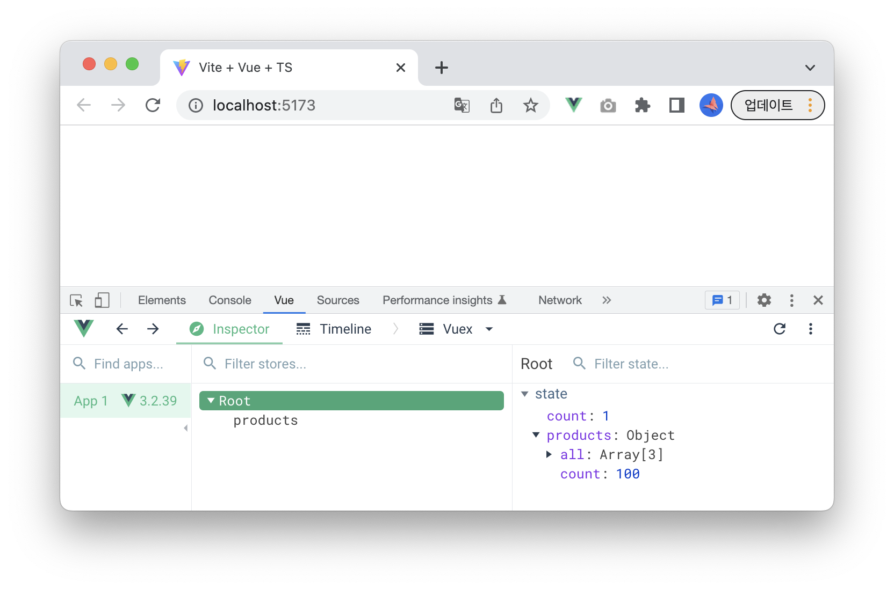
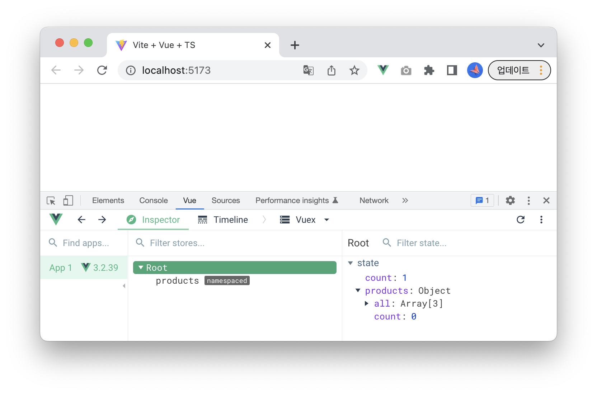

# Modules

단일 상태 트리를 사용하기 때문에 애플리케이션의 모든 상태가 하나의 큰 객체 안에 포함됩니다. 그러나 규모가 커짐에 따라 저장소는 매우 비대해질 수 있습니다.  
이를 위해 Vuex는 저장소를 모듈로 나눌 수 있습니다. 각 모듈은 자체 상태, 변이, 액션, 게터 및 심지어 중첩된 모듈을 포함 할 수 있습니다.

## 지역 상태 모듈

`store` 폴더 아래에 `modules` 폴더를 생성하고 다음과 같은 파일 구조를 만듭니다.
```bash
vuex-quick-starts
├── src
│   ├── components
│   │   └── HelloWorld.vue
# highlight-start
│   ├── store
│   │   ├── modules
│   │   │   ├── products
│   │   │   │   └── index.ts
│   │   │   └── carts
│   │   │       └── index.ts
│   │   └── index.ts
# highlight-end
│   └── main.ts
├── index.html
├── package.json
└── vite.config.ts
```

### 모듈 생성하기

```ts title="/src/store/modules/products/index.ts" showLineNumbers
import { Module } from "vuex";
// highlight-next-line
import { State as RootState } from "../../index";

// highlight-next-line
export interface State {
  all: number[],
  count: number
}

// highlight-next-line
export const products:Module<State, RootState> = {
  state: {
    all: [1, 2, 3],
    count: 0
  },
  getters: {
  },
  mutations: {
  },
  actions: {
  },
} 
```

### 모듈 등록하기

```ts title="/src/store/index.ts"
import { InjectionKey } from 'vue'
import { createStore, Store, useStore as baseUseStore } from 'vuex'
// highlight-next-line
import { products } from './modules/products'

// ...

export const store = createStore<State>({
  // ...
  modules: {
    // highlight-next-line
    products
  }
})
```

:::warning

**'State' 형식에 'products' 속성이 없습니다.** 에러가 발생합니다.
```ts title="/src/App.vue" showLineNumbers
<script lang="ts">
import { defineComponent } from "vue";
import { useStore } from "./store";

export default defineComponent({
  setup() {
    const store = useStore();
    console.log(store.state.count);
    // highlight-next-line
    console.log(store.state.products.all);
    return {};
  },
});
</script>
```
:::

### Property 'products' does not exist on type 'State'. 해결하기

모듈을 등록한 후 TypeScript에서 useStore내의 타입을 올바르게 추론하려면 `store` 타이핑 정의에 모듈 상태를 등록합니다.

```ts title="/src/store/index.ts"
import { InjectionKey } from 'vue'
import { createStore, Store, useStore as baseUseStore } from 'vuex'
// highlight-next-line
import { products, State as ProductsState } from './modules/products'

// define typings for the store state
export interface State {
  count: number,
  // highlight-next-line
  products: ProductsState
}

// define injection key
export const key: InjectionKey<Store<State>> = Symbol()

export const store = createStore<State>({
  state: {
    count: 0
  // highlight-next-line
  } as State,
  getters: {
  },
  mutations: {
  },
  actions: {
  },
  modules: {
    products
  }
})
```

### actions/mutations/getters 외부 파일로 분리
```bash
vuex-quick-starts
├── src
│   ├── store
│   │   ├── modules
│   │   │   └── products
# highlight-start
│   │   │       ├── actions.ts
│   │   │       ├── mutations.ts
│   │   │       ├── getters.ts
# highlight-end
│   │   │       └── index.ts
│   │   └── index.ts
│   └── main.ts
├── index.html
├── package.json
└── vite.config.ts
```

import Tabs from '@theme/Tabs';
import TabItem from '@theme/TabItem';

<Tabs>
<TabItem value="actions" label="actions.ts">

```ts title="/src/store/modules/products/actions.ts"
export default {}
```

</TabItem>
<TabItem value="mutations" label="mutations.ts">

```ts title="/src/store/modules/products/mutations.ts"
export default {}
```

</TabItem>
<TabItem value="getters" label="getters.ts">

```ts title="/src/store/modules/products/getters.ts"
export default {}
```

</TabItem>
</Tabs>

```ts title="/src/store/modules/products/index.ts"
import { Module } from "vuex";
import { State as RootState } from "../../index";
// highlight-start
import actions from "./actions";
import getters from "./getters";
import mutations from "./mutations";
// highlight-end

export interface State {
  all: number[],
  count: number
}

export const products:Module<State, RootState> = {
  state: {
    all: [1, 2, 3],
    count: 0
  },
  // highlight-start
  getters,
  mutations,
  actions
  // highlight-end
} 
```

### state 변수 추출하기
```ts title="/src/store/modules/products/index.ts"
export interface State {
  all: number[],
  count: number
}

// highlight-start
// initial state
const state:State = {
  all: [1, 2, 3],
  count: 0
}
// highlight-end

export const products:Module<State, RootState> = {
  // highlight-next-line
  state,
  getters,
  mutations,
  actions
} 
```

## 네임스페이스
기본적으로 모듈 내의 액션, 변이 및 getter는 여전히 전역 네임 스페이스 아래에 등록됩니다. 여러 모듈이 동일한 변이/액션 유형에 반응할 수 있습니다.

### 테스트 케이스 작성
```ts title="/src/store/index.ts"
// ...
export const store = createStore<State>({
  state: {
    count: 0
  } as State,
  getters: {
  },
  mutations: {
    // highlight-start
    increment(state) {
      state.count++
    }
    // highlight-end
  },
  actions: {
  },
  modules: {
    products
  }
})
```
```ts title="/src/store/modules/products/mutations.ts"
import { State } from "."

export default {
  // highlight-start
  increment(state: State) {
    state.count += 100
  }
  // highlight-end
}
```
```js title="src/App.vue"
<script lang="ts">
import { defineComponent } from "vue";
import { useStore } from "./store";

export default defineComponent({
  setup() {
    const store = useStore();
    // highlight-next-line
    store.commit('increment')
    return {};
  },
});
</script>
```



### Namespacing
모듈이 독립적이거나 재사용되기를 원한다면, `namespaced: true` 라고 네임스페이스에 명시하면 됩니다. 모듈이 등록될 때, 해당 모듈의 모든 getter, 액션/변이는 자동으로 등록된 모듈의 경로를 기반으로 네임스페이스가 지정됩니다. 

```ts title="/src/store/modules/products/index.ts"
// ...
export const products:Module<State, RootState> = {
  // highlight-next-line
  namespaced: true,
  state,
  getters,
  mutations,
  actions
} 
```



:::info
products 모듈의 mutation 핸들러를 호출 하려면 접두어(`products/`)를 사용합니다.

```js title="src/App.vue"
<script lang="ts">
import { defineComponent } from "vue";
import { useStore } from "./store";

export default defineComponent({
  setup() {
    const store = useStore();
    // store.commit('increment')
    // highlight-next-line
    store.commit('products/increment')
    return {};
  },
});
</script>
```


:::