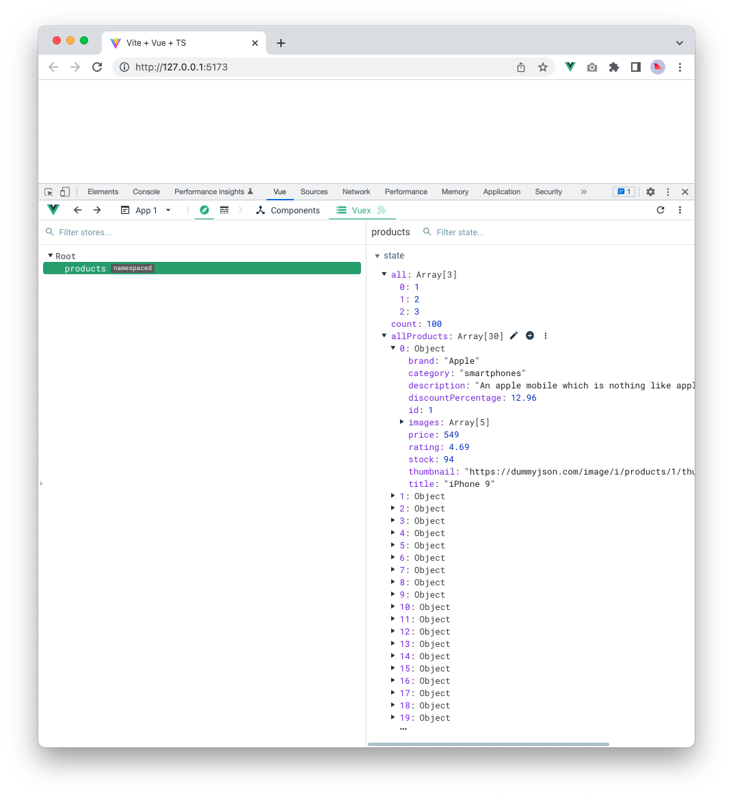

# Dispatching Actions

액션은 store.dispatch 메소드로 시작됩니다.

```ts title="/src/App.vue"
// ...
<script lang="ts">
import { defineComponent } from "vue";
import { useStore } from "./store";

export default defineComponent({
  setup() {
    const store = useStore();
    console.log(store.state.count);
    console.log(store.state.products.all);
    store.commit("products/increment");
    // highlight-next-line
    store.dispatch("products/getAllProducts");
    return {};
  },
});
</script>
```


